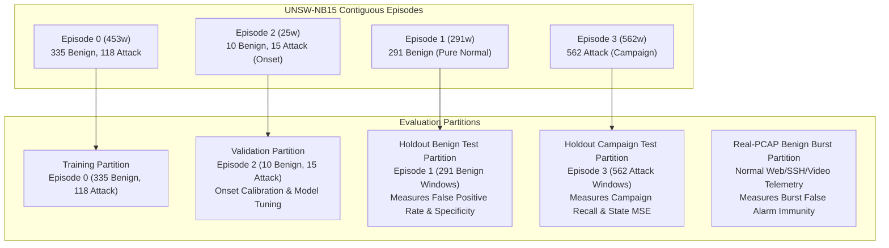

# NexSolve Final World Model — Evaluation Protocol Specification

**Document ID:** `docs/FINAL_EVALUATION_PROTOCOL.md`  
**Governing Standard:** NexSolve Scientific Telemetry & Causal Time-Series Protocol  
**Audit Finding Addressed:** Audit Finding #8 (Test split contains 100% attack windows, precluding false-positive evaluation on that partition)  

---

## 1. Dataset Composition & Ground Truth Analysis

The canonical UNSW-NB15 60-second window dataset (`data/processed/unsw_network_states.json`) consists of 1,441 contiguous network state observations partitioned across 5 distinct chronological episodes:

| Episode Index | Start Timestamp (UTC) | End Timestamp (UTC) | Duration (min) | Benign Windows | Attack Windows | Total Windows | Attack Ratio |
| :---: | :---: | :---: | :---: | :---: | :---: | :---: | :---: |
| **Episode 0** | 1421927340 (Jan 22, 11:49) | 1421954460 (Jan 22, 19:21) | 452 | 335 | 118 | 453 | 26.05% |
| **Episode 1** | 1421955300 (Jan 22, 19:35) | 1421972700 (Jan 23, 00:25) | 290 | 291 | 0 | 291 | 0.00% |
| **Episode 2** | 1424218980 (Feb 18, 00:23) | 1424220420 (Feb 18, 00:47) | 24 | 10 | 15 | 25 | 60.00% |
| **Episode 3** | 1424221560 (Feb 18, 01:06) | 1424255220 (Feb 18, 10:27) | 561 | 0 | 562 | 562 | 100.00% |
| **Episode 4** | 1424255520 (Feb 18, 10:32) | 1424262060 (Feb 18, 12:21) | 109 | 0 | 110 | 110 | 100.00% |

### Key Physical Telemetry Characteristics:
1. **Day 1 (Episodes 0 & 1):** Captures normal business operations interspersed with isolated scanning bursts (Episode 0), followed by 4.8 hours of uninterrupted benign traffic (Episode 1).
2. **Day 2 (Episodes 2, 3, & 4):** Separated from Day 1 by a 26-day gap. Episode 2 captures 10 benign baseline windows followed by an attack onset and recovery. Episodes 3 and 4 represent a continuous, uninterrupted multi-hour adversarial attack campaign with zero benign windows.

---

## 2. Root Cause of the Test Split Limitation

In the historical Candidate V2 chronological split (`v2_chronological_split`):
- `Train`: Episodes 0 + 1 (744 windows: 626 benign, 118 attack).
- `Validation`: Episode 2 (25 windows: 10 benign, 15 attack).
- `Test`: Episode 3 (562 windows: 0 benign, 562 attack).

**Mathematical Impact on Test Evaluation:**
Because Episode 3 contains **zero benign samples** ($y_{\text{true}} = 1$ for all samples):
$$\text{False Positives } (FP) = 0 \quad (\text{mathematically impossible})$$
$$\text{Precision} = \frac{TP}{TP + FP} = \frac{TP}{TP + 0} = 1.0000 \quad (\text{always})$$
$$\text{Specificity} = \frac{TN}{TN + FP} = \text{undefined } (0 / 0)$$
$$\text{ROC-AUC} = \text{undefined } (\text{requires both positive and negative classes})$$
$$\text{PR-AUC} = \text{undefined } (\text{requires both positive and negative classes})$$

Consequently, evaluating on Episode 3 alone proves high detection recall and accurate continuous state forecasting under sustained attack, but provides **zero information regarding false alarm rates on benign traffic**.

---

## 3. Strict Non-Fabrication Rules

1. **Zero Synthetic Benign Generation:** The system shall **never** synthesize fake benign windows or interpolate non-existent data into Episode 3.
2. **Strict Chronological Invariance:** The system shall **never** randomly shuffle windows across time or across episodes.
3. **No Boundary Leakage:** Sequences generated via `make_episode_sequences` must reside strictly within contiguous timestamps; no lookback window may span an episode gap.
4. **Explicit Reporting:** If a test partition contains only one class, this limitation must be explicitly recorded in evaluation artifacts rather than coerced to 1.0000.

---

## 4. Hardened Multi-Partition Evaluation Protocol

To rigorously evaluate both false alarm resilience and detection performance without violating temporal causality, the Hardened Final Model implements a **Multi-Partition Chronological Evaluation Protocol**:

### Partition 1: Training Partition (Chronological Past)
- **Episodes:** Episode 0 (453 windows, 445 sequences).
- **Composition:** 335 benign windows, 118 attack windows.
- **Normalization:** Feature scaler (mean, scale) is fit strictly on this partition.

### Partition 2: Validation Partition (Chronological Onset Evaluation)
- **Episode:** Episode 2 (25 windows, 17 sequences).
- **Composition:** 10 benign windows, 15 attack windows.
- **Evaluation Role:**
  - Evaluates early onset detection ($T+1$ lead time).
  - Both classes present: Computes true Precision, Recall, F1, PR-AUC, ROC-AUC, Brier score, and ECE.
  - Used strictly for decision threshold calibration ($\tau^*$).

### Partition 3: Holdout Benign Test Partition (False Positive Evaluation)
- **Episode:** Episode 1 (291 windows, 283 sequences).
- **Composition:** 291 benign windows, 0 attack windows.
- **Evaluation Role:**
  - Evaluates False Positive Rate ($FPR = FP / 283$).
  - Evaluates Specificity ($TN / (TN + FP)$).
  - Evaluates false alarm suppression over 4.8 hours of uninterrupted normal traffic.

### Partition 4: Holdout Campaign Test Partition (Sustained Attack Trajectory)
- **Episode:** Episode 3 (562 windows, 554 sequences).
- **Composition:** 0 benign windows, 562 attack windows.
- **Evaluation Role:**
  - Evaluates multi-horizon continuous state forecasting MSE ($T+1..T+5$).
  - Evaluates multi-step sustained detection recall.
  - Evaluates kill-chain progression index tracking.

### Partition 5: Real PCAP Benign Burst Evaluation
- **Capture Corpus:** Benign slices of legitimate network activity (e.g. `friday_10windows_slice.pcap` initial phase, standard SSH/HTTPS traffic).
- **Evaluation Role:**
  - Tests whether sudden high-volume benign file transfers or connection bursts trigger false positive alarms.
  - Confirms that volumetric surges decouple from MITRE taxonomy classifications unless behavioral ratios (SYN/ACK, RST rate) also deviate.

---

## 5. Metric Calculation & Reporting Standard

1. **Two-Class Partitions (Validation & Combined Holds):**
   - Report: Precision, Recall, F1 Score, Balanced Accuracy, PR-AUC, ROC-AUC, Brier Score, ECE.
2. **Benign-Only Partitions (Partition 3):**
   - Report: Total Windows, True Negatives ($TN$), False Positives ($FP$), False Positive Rate ($FPR = FP / Total$), Specificity ($TN / Total$).
   - Explicitly note: Precision, Recall, F1, and AUC are undefined on single-class partitions.
3. **Attack-Only Partitions (Partition 4):**
   - Report: Total Windows, True Positives ($TP$), False Negatives ($FN$), Recall ($TP / Total$), Continuous State MSE, State MAE.
   - Explicitly note: Precision is bounded to 1.0000; AUC is undefined (`null`).
