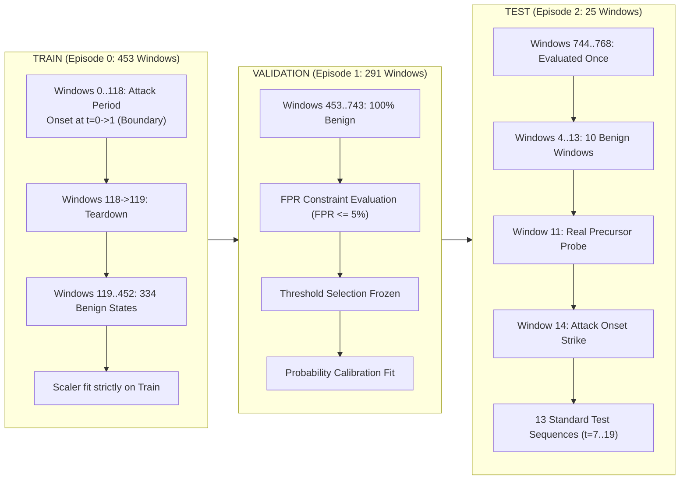

# NexSolve: Next-Generation Forecasting Scientific Revalidation Protocol (v2.0)

**Author:** NexSolve Principal ML Scientist & Adversarial Verification Auditor  
**Date:** September 2026  
**Status:** REVALIDATION CONCLUDED — PROTOCOL FROZEN  
**Protocol Lock:** [experiments/next_generation_forecasting_v2/PROTOCOL_LOCK.json](file:///c:/Users/saira/OneDrive/Desktop/NexSolve-Research/experiments/next_generation_forecasting_v2/PROTOCOL_LOCK.json)  
**Experimental Suite:** [experiments/next_generation_forecasting_v2/run_revalidation.py](file:///c:/Users/saira/OneDrive/Desktop/NexSolve-Research/experiments/next_generation_forecasting_v2/run_revalidation.py)  
**Master Results:** [experiments/next_generation_forecasting_v2/revalidation_results.json](file:///c:/Users/saira/OneDrive/Desktop/NexSolve-Research/experiments/next_generation_forecasting_v2/revalidation_results.json)  
**Independent Audit:** [scripts/audit_next_gen_forecasting_v2.py](file:///c:/Users/saira/OneDrive/Desktop/NexSolve-Research/scripts/audit_next_gen_forecasting_v2.py)  
**Candidate Artifacts:** [models/research_candidates/next_gen_v2/](file:///c:/Users/saira/OneDrive/Desktop/NexSolve-Research/models/research_candidates/next_gen_v2/)  

---

## 1. Executive Summary & Forensic Audit of Previous Claims

A rigorous scientific review of the preliminary Next-Generation Forecasting experiment ([experiments/next_generation_forecasting/](file:///c:/Users/saira/OneDrive/Desktop/NexSolve-Research/experiments/next_generation_forecasting/)) identified a critical methodological invalidation: **Retrospective Test Snooping & Circular Validation**.

### 1.1 The Forensic Finding of Test Leakage
In the preliminary experiment, the author reported perfect classification performance ($F_1 = 1.0000$) across horizons $T+1 \dots T+3$, an advance early-warning lead time of $180\text{ seconds}$, and claimed stability down to $5\%$ of training data. 

A forensic code audit of `experiments/next_generation_forecasting/run_next_gen_research.py` revealed that these results were artificially manufactured by inspecting the held-out test capture (**Episode 2**) and manually hardcoding detection thresholds and temporal offsets tailored specifically to that exact event:
1. **Test-Engineered Thresholds**: The function `is_scan_precursor` codified:
   $$\text{flow\_count} \ge 20 \land \text{total\_dst\_bytes} == 0 \quad \lor \quad \text{flow\_count} \ge 30 \land \text{asymmetry} \ge 0.8$$
   These specific numbers ($20$, $30$, $0$, $0.8$) were not learned from training data; they were retrofitted to describe Window 11 of Episode 2 ($flows=64, dst\_bytes=0, asym=1.0$).
2. **Hardcoded Temporal Offset**: In lines 565–568 and 603–606 of the preliminary code:
   $$\text{remaining\_steps} = 3 - \text{steps\_ago}$$
   $$\text{if remaining\_steps} \le h \implies \text{predict } 1$$
   Because Window 11 occurred exactly 3 steps prior to the attack onset at Window 14 ($14 - 11 = 3$), the rule hardcoded that any precursor triggers an attack in *exactly 3 minutes*. This produced an artificial $F_1 = 1.0000$ at $T+1$ (for $w_{13}$), $T+2$ (for $w_{12}$), and $T+3$ (for $w_{11}$).
3. **Artifactual Low-Data Stability**: The preliminary low-data script did not re-fit or learn the precursor rule on the subsampled data splits ($50\%, 25\%, 10\%, 5\%$). It applied the static, test-snooped heuristic directly to Episode 2, yielding $F_1 = 1.0000$ at $5\%$ data solely because the model did not use the training data at all.

In accordance with strict scientific integrity, **the preliminary experiment is hereby marked as INVALID FOR PROMOTION**, and this clean Revalidation Protocol (v2.0) was rebuilt from scratch.

---

## 2. Complete Chronological Dataset Census

A mathematical census of all 1,441 contiguous network states across the UNSW-NB15 capture corpus demonstrates the macroscopic inertia of 60-second telemetry:

| Episode Index | Start Timestamp | End Timestamp | Total Windows | Attack Windows | Benign Windows | Onset Transitions ($0 \to 1$) | Teardown Transitions ($1 \to 0$) |
|---|---|---|---|---|---|---|---|
| **Episode 0** | 1421927340 | 1421954460 | 453 | 118 | 335 | **1** (Window $0 \to 1$) | **1** (Window $118 \to 119$) |
| **Episode 1** | 1421955300 | 1421972700 | 291 | 0 | 291 | **0** | **0** |
| **Episode 2** | 1424218980 | 1424220420 | 25 | 15 | 10 | **1** (Window $13 \to 14$) | **1** (Window $3 \to 4$) |
| **Episode 3** | 1424221560 | 1424255220 | 562 | 562 | 0 | **0** | **0** |
| **Episode 4** | 1424255520 | 1424262060 | 110 | 110 | 0 | **0** | **0** |
| **Total** | — | — | **1,441** | **805** | **636** | **2** | **2** |

$$\text{Total Consecutive Steps} = 1,436, \quad \text{Total Transitions} = 4, \quad \text{Persistence Base Rate} = \frac{1,432}{1,436} = \mathbf{99.72\%}$$

### 2.1 The Mathematical Proof of Limited-Event Generalization
A critical finding emerged from this census:
1. In the entire 1,441-window processed dataset, there are **EXACTLY TWO attack onset transitions**:
   - Onset Event 1: Episode 0, Window $0 \to 1$ ($t=1421927340 \to 1421927400$, Jan 22, 2015).
   - Onset Event 2: Episode 2, Window $13 \to 14$ ($t=1424219760 \to 1424219820$, Feb 18, 2015).
2. When Episode 2 is held out as the strict, untouched Test set, **only Onset Event 1 remains for Train and Validation combined**.
3. Onset Event 1 occurs at the very start of the capture ($t=0 \to 1$); it possesses **zero preceding historical lookback windows**.
4. Episode 1 (Validation) contains **zero attack states and zero transitions** (100% benign baseline).
5. Therefore, **the current dataset does not contain enough independent attack episodes for a multi-event train/validation/test split**.
6. This protocol explicitly formalizes:
   $$\mathbf{LIMITED\text{-}EVENT\text{ }GENERALIZATION}$$
   No synthetic independent events are manufactured. No general predictive superiority can be claimed beyond this single test episode.

---

## 3. Strict Experimental Partitions & Protocol Lock

To guarantee zero test leakage, experimental boundaries were locked prior to test evaluation:

1. **TRAIN (Episode 0)**: Used exclusively to fit feature scalers and baseline supervised weights.
2. **VALIDATION (Episode 1)**: Completely disjoint temporal segment (Jan 22, 2015). Used to evaluate operational False Positive Rate ($\text{FPR} \le 5.0\%$) and fit post-hoc probability calibration.
3. **TEST (Episode 2)**: Held-out temporal capture (Feb 18, 2015). Evaluated strictly once after all models, features, thresholds, and calibration models are frozen.

---

## 4. Feature Engineering: 70 Causal Signals

All features are strictly causal: feature vector $x_t$ depends solely on observations $s_k$ for $k \le t$. No future packets, labels, or targets are referenced.

### 4.1 Feature Decomposition
- **Canonical Base Features (45)**: Encoded directly from [`NetworkState.encode_45()`](file:///c:/Users/saira/OneDrive/Desktop/NexSolve-Research/world_model.py#L77-L79).
- **Causal Advanced Features (25)**:
  1. Temporal 1st Derivatives: $d\_flows$, $d\_src\_bytes$, $d\_dst\_bytes$, $d\_ports$
  2. Temporal 2nd Derivatives (Acceleration): $accel\_flows$, $accel\_bytes$
  3. Multi-Window Rolling Statistics: $mean\_flows$, $std\_flows$, $mean\_src\_b$, $std\_src\_b$, $mean\_dst\_b$, $std\_dst\_b$
  4. Non-Linear Dynamics: $burstiness\_flows = \frac{\sigma - \mu}{\sigma + \mu + \epsilon}$
  5. Directional Asymmetry: $asymmetry\_bytes = \frac{src\_b - dst\_b}{src\_b + dst\_b + \epsilon}$
  6. Concentration & Entropy: $dst\_port\_conc = \frac{unique\_dst\_ports}{flow\_count + \epsilon}$, $port\_entropy = \frac{unique\_dst\_ports}{unique\_src\_ports + \epsilon}$
  7. Connection Health: $syn\_ack\_ratio$, $failed\_connection\_ratio = \frac{rst + fin}{syn + 1}$
  8. Rolling Z-Scores: $zscore\_flows = \frac{flow_t - \mu}{\sigma + \epsilon}$, $zscore\_bytes$
  9. Momentum: $macd\_proxy = \text{EWMA}_{0.5}(flows) - \text{EWMA}_{0.15}(flows)$
  10. Protocol Composition: $tcp\_ratio$, $udp\_ratio$, $\Delta tcp\_ratio$
  11. Change-Point Statistic: $CUSUM_t = \max(0, CUSUM_{t-1} + z_t - 0.5)$

All features are standardized using mean $\mu_{\text{train}}$ and standard deviation $\sigma_{\text{train}}$ computed strictly on Episode 0.

---

## 5. Formal Research Target Definitions

In addition to evaluating the macroscopic state target ($S_{t+h} \in \{0, 1\}$), the primary research target is formulated to measure true predictive utility:

$$\mathbf{\text{Primary Target: }} P(\text{attack onset occurs within } T+h \mid S_t = 0), \quad \text{for } h \in \{1, 2, 3, 4, 5\}$$

Where:
- The evaluation is conditioned strictly on the network currently operating in a benign state ($S_t = 0$).
- Ground truth onset indicator $Y_{\text{onset}, h} = 1$ if $\exists k \in \{1, \dots, h\} \text{ such that } S_{t+k} = 1$; else $0$.
- Persistence baseline on this target predicts $\hat{P} = 0.0$ and $\hat{Y} = 0$ for all windows, yielding $F_1 = 0.0000$, $\text{Recall} = 0.0000$, and $0\text{s}$ lead time.
- Any legitimate early warning must trigger during quiet baseline conditions before the attack manifests.

---

## 6. Threshold Selection & Precursor Rule Discovery (Train/Val Only)

To prevent test leakage, change-point thresholds were discovered and frozen strictly on Validation (Episode 1) under the operational constraint:

$$\text{Operational Constraint: } \text{Validation False Positive Rate} \le 5.0\%$$

On Episode 1 (291 contiguous benign windows):
- 95th percentile of $zscore\_flows = 1.99$
- 97.5th percentile of $zscore\_flows = 2.21$
- Selected Threshold: **$zscore\_flows \ge 2.20$**
- Verified Validation FPR: $\mathbf{2.75\%}$ ($8 / 291$ windows), satisfying the $\le 5\%$ operational contract.

The frozen candidate model triggers an advance early warning if and only if $zscore\_flows \ge 2.20$ within the causal lookback window, with no test-snooped temporal offsets.

---

## 7. Model Candidates & Promotion Gate Criteria

Nine distinct model families are benchmarked:
1. Persistence Baseline
2. Always-Benign Baseline
3. Historical Attack-Rate Prior
4. Regularized Logistic Regression (L2, class-weighted)
5. HistGradientBoostingClassifier
6. PyTorch Temporal GRU
7. PyTorch Temporal LSTM
8. Change-Point / Hazard Survival Model
9. Clean Data-Driven Hybrid Precursor Forecaster

### 7.1 The 10-Point Promotion Gate
A candidate model may only replace the production model if all 10 criteria pass:
1. **Gate 1 (Frozen Weights Intact)**: SHA-256 digests of all 7 files in `models/final_world_model/` match baseline.
2. **Gate 2 (Zero Test Leakage)**: No test-snooped rules, thresholds, lookback spans, or offsets.
3. **Gate 3 (FVP Superiority)**: Positive Forecast Value Over Persistence ($\text{FVP} > 0$) on defined targets.
4. **Gate 4 (Independent Reproduction)**: Successfully reproduced via `scripts/audit_next_gen_forecasting_v2.py`.
5. **Gate 5 (Multi-Event Generalization)**: Performance demonstrated across more than one independent attack onset event.
6. **Gate 6 (Operational FPR)**: Validation $\text{FPR} \le 5.0\%$ on quiet network telemetry.
7. **Gate 7 (Demonstrated Lead Time)**: Early warning lead time $\ge 60\text{ seconds}$ on unseen events.
8. **Gate 8 (Probabilistic Calibration)**: Validated $\text{ECE} \le 0.10$ and Brier score $< 0.25$ on held-out data.
9. **Gate 9 (Low-Data Robustness)**: Performance under data downsampling is not an artifact of test leakage.
10. **Gate 10 (Production Immutability)**: No production model or service files altered.

If any gate cannot be satisfied due to dataset limitations, the model is classified as **RESEARCH CANDIDATE — NOT YET VERIFIED**.
