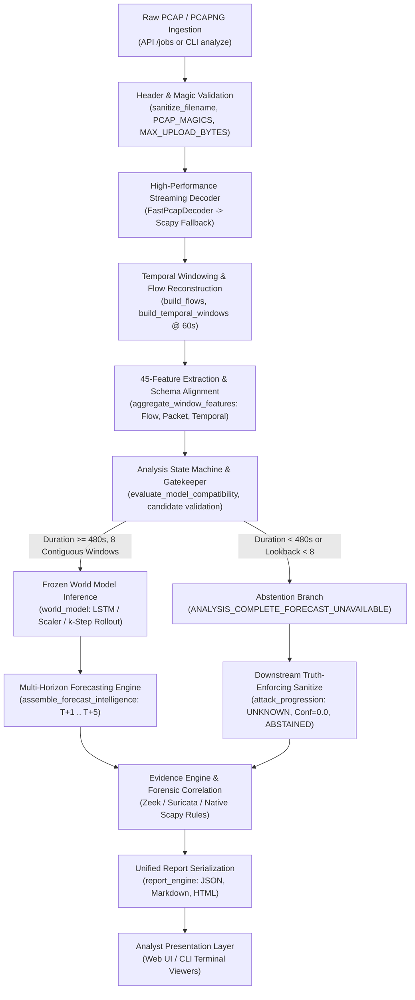

# NexSolve Production Excellence Audit: End-to-End Architectural Call Graph

**Document Version:** 1.0.0  
**Audit Date:** September 2026  
**Auditor Roles:** Principal ML Scientist, Cybersecurity Detection Engineer, Production Architect, Reliability Engineer, Adversarial QA Lead  
**Scope:** Complete verification of all 10 pipeline tiers from PCAP ingestion to rendered analyst UI.

---

## 1. Architectural Call Graph Overview

---

## 2. Component Contracts & Tier Specifications

### Tier 1: Ingestion & Boundary Hardening
- **Module:** `model_service.app`, `model_service.pcap_upload`, `nexsolve_core.config`
- **Function/Class:** `create_job()`, `analyze_uploaded_capture()`
- **Input Contract:**
  - Raw binary stream from HTTP multipart/form-data or CLI file descriptor.
  - Declared filename: `str`
- **Output Contract:**
  - Standardized JSON Job Descriptor: `{"job_id": str, "status": "queued" | "completed" | "failed"}`
- **Preconditions:**
  - Stream length $\le 1{,}073{,}741{,}824$ bytes ($1\text{ GiB}$).
  - Filename matches allowed extensions: `.pcap`, `.pcapng`, `.cap`.
- **Invariants:**
  - No directory traversal characters allowed; sanitized via `sanitize_filename()`.
  - Magic byte header checked before allocation: `0xa1b2c3d4`, `0xd4c3b2a1`, `0xa1b23c4d`, `0x4d3cb2a1`, `0x0a0d0d0a`.
- **Failure Behavior:**
  - Unrecognized extension: HTTP 415.
  - Oversized payload: HTTP 413 (`ResourceLimitExceededError`).
  - Empty file ($0$ bytes): HTTP 400 / `ValueError`.

### Tier 2: Binary Packet Decoding & Flow Assembly
- **Module:** `ml.data.fast_pcap_decoder`, `ml.data.pcap_extractor`
- **Function/Class:** `FastPcapDecoder.decode()`, `extract_canonical_capture()`
- **Input Contract:**
  - `Path` to verified capture file on disk.
- **Output Contract:**
  - `PcapExtractionResult` containing parsed `PacketRecord` sequence and window metadata.
- **Preconditions:**
  - File accessible and readable on filesystem.
- **Invariants:**
  - Nanosecond or microsecond timestamps converted to standard floating-point UNIX epoch seconds.
  - Packets strictly sorted chronologically before window assignment ($t_i \le t_{i+1}$).
  - Truncated or malformed frames safely skipped or recorded in `malformed_packets` counter.
- **Fallback Behavior:**
  - If `FastPcapDecoder` encounters unsupported encapsulation (e.g. rare link types, complex IP options), execution cleanly falls back to Scapy `PcapNgReader` / `RawPcapReader`.

### Tier 3: 45-Feature Extraction & Windowing
- **Module:** `ml.data.packet_features`, `nexsolve_core.schemas`
- **Function/Class:** `aggregate_window_features()`, `build_flows()`, `build_temporal_windows()`
- **Input Contract:**
  - Chronological `list[PacketRecord]`, `window_size_seconds = 60.0`.
- **Output Contract:**
  - `list[TemporalWindow]` containing exactly:
    - 17 Flow Features (`flow_count`, `total_src_bytes`, `unique_dst_ports`, etc.)
    - 22 Packet Features (`packet_count`, `mean_packet_size`, `tcp_syn_count`, etc.)
    - 6 Temporal Features (`delta_flow_count`, `delta_total_bytes`, `rolling_total_bytes`, etc.)
- **Invariants:**
  - Total feature dimension is strictly 45 (or 46 if canonical RTT schema is explicitly targeted).
  - **Zero Synthetic RTT:** If passive capture lacks bi-directional TCP 3-way handshakes, RTT is never fabricated with synthetic defaults.

### Tier 4: Analysis State Machine & Model Compatibility Gate
- **Module:** `nexsolve_core.state`, `model_service.pcap_upload`
- **Function/Class:** `evaluate_model_compatibility()`, `build_network_state_candidates()`
- **Input Contract:**
  - `list[TemporalWindow]`, `model_dir: Path`
- **Output Contract:**
  - `AnalysisStateCompatibility`:
    - `analysis_state`: `ANALYSIS_COMPLETE_FORECAST_READY` or `ANALYSIS_COMPLETE_FORECAST_UNAVAILABLE`
    - `candidate_states`: `tuple[NetworkState, ...]`
    - `is_forecast_available`: `bool`
    - `abstention_reason`: `str | None`
- **Preconditions:**
  - Must evaluate window count against `LOOKBACK = 8` (480 seconds minimum duration).
- **Invariants:**
  - If duration $< 480\text{s}$ or contiguous windows $< 8$, system enters `FORECAST_UNAVAILABLE` abstention gate.
  - No synthetic padding of historical windows is permitted.

### Tier 5: World Model Inference
- **Module:** `world_model`, `models.final_world_model`
- **Function/Class:** `infer()`, `forecast_k_steps()`, `load_model()`
- **Input Contract:**
  - Input tensor $X \in \mathbb{R}^{B \times 8 \times 45}$ (8 lookback steps, 45 features).
- **Output Contract:**
  - Forecast state sequence $\hat{X}_{t+1 \dots t+5} \in \mathbb{R}^{B \times 5 \times 45}$
  - Transition logits and attack probability $\hat{p} \in [0, 1]^5$
- **Invariants:**
  - Frozen model weights (`models/final_world_model/model.npz`) are strictly read-only.
  - Standard scaling parameters (`mean`, `scale`) applied identically to training distribution.

### Tier 6: Multi-Horizon Forecasting Engine & Sanitization
- **Module:** `ml.forecasting`, `ml.forecasting.attack_progression`
- **Function/Class:** `assemble_forecast_intelligence()`, `forecast_attack_progression()`
- **Input Contract:**
  - Model outputs, observed state history, `forecast_engine_abstained: bool`, `forecast_engine_abstention_reason: str`.
- **Output Contract:**
  - `AttackProgressionTimeline`:
    - Observed windows $t_0 \dots t_n$: empirical stage classifications based on packet evidence.
    - Future horizons $T+1 \dots T+5$: forecasted stages, or if abstained, `stage = UNKNOWN`, `confidence = 0.0`, `abstained = True`.
- **Invariants (Zero-Tolerance Consistency Contract):**
  - Whenever the primary forecast engine abstains (due to cold-start, duration $< 480\text{s}$, or feature contract mismatch), all future timeline horizons $T+1 \dots T+5$ MUST be marked `UNKNOWN` with `0.0` confidence and `FORECAST ABSTAINED:` description.
  - No synthetic confidence scores (e.g. 0.90) or fabricated benign forecasts are permitted.

### Tier 7: Forensic Evidence & Detection Rule Correlation
- **Module:** `ml.detection`, `ml.evidence`
- **Function/Class:** `analyze_packet_windows()`, `traffic_summary()`, `EvidenceGraph`
- **Input Contract:**
  - `PcapExtractionResult`, raw packet records.
- **Output Contract:**
  - Grounded detection events with explicit packet indices, source/destination IPs, ports, and MITRE technique IDs (e.g. `T1046`, `T1071`).
- **Invariants:**
  - If no malicious signatures or statistical anomalies are observed, detected events list is empty (`[]`).
  - No synthetic port scans or fake recon indicators are fabricated.

### Tier 8: Unified Report Serialization
- **Module:** `reporting.report_sections`, `reporting.report_engine`
- **Function/Class:** `build_attack_progression()`, `generate_markdown_report()`, `generate_html_report()`
- **Input Contract:**
  - Pipeline analysis payload dictionary.
- **Output Contract:**
  - Cryptographically reproducible JSON, standalone Markdown, and static HTML reports.
- **Invariants:**
  - Markdown and HTML reports must perfectly mirror JSON state.
  - If abstained, visual progression displays `STATUS: ABSTAINED` banner and `Withheld` indicators.

### Tier 9: Analyst Presentation (UI & CLI)
- **Module:** `frontend.src.components.JobResult`, `cli.output.terminal`
- **Function/Class:** `JobResult.tsx`, `AttackProgressionTimeline.tsx`, `TerminalRenderer`
- **Input Contract:**
  - Parsed JSON report payload.
- **Output Contract:**
  - Rendered DOM tree or ANSI color terminal stream.
- **Invariants:**
  - Never synthesize fake risk curves (e.g. 78.6% escalating risk) when data is missing.
  - Never display fake drivers or fake MITRE cards when observed behavior is benign or abstained.

---

## 3. Failure & Abstention Decision Matrix

| Stage | Trigger Condition | Code Emitted | Downstream Impact | UI Presentation |
| :--- | :--- | :--- | :--- | :--- |
| **Ingestion** | Empty file ($0$ bytes) | `ValueError` | HTTP 400 Bad Request | "Error: The uploaded capture is empty." |
| **Ingestion** | Magic bytes mismatch | `RuntimeError` | HTTP 400 / 415 | "Error: Unsupported capture format." |
| **Ingestion** | File size $> 1\text{ GiB}$ | `ResourceLimitExceededError` | HTTP 413 Payload Too Large | "Error: File exceeds 1024 MiB upload limit." |
| **Ingestion** | Traversal characters in name | Sanitized in-flight | Basename extracted safely | Clean basename displayed |
| **Windowing** | Duration $< 60\text{s}$ | Window count = 1 | Static forensic triage only | "Single Window Mode (<60s)" |
| **Model Gate** | Contiguous windows $< 8$ | `ANALYSIS_COMPLETE_FORECAST_UNAVAILABLE` | Forecast engine withheld | "Forecast Abstained: Duration < 480s" |
| **Model Gate** | Passive capture lacks RTT | `MODEL_FEATURE_CONTRACT_MISMATCH` | Model inference skipped | "Forecast Abstained: Passive RTT unavailable" |
| **Forecasting** | Engine abstains | `abstained: true`, `conf: 0.0` | T+1..T+5 set to `UNKNOWN` | Grayed-out timeline, "Withheld" badge |
| **Detection** | No attacks detected | `detected_events: 0` | Evidence graph empty | Honest "No threats detected" empty state |
